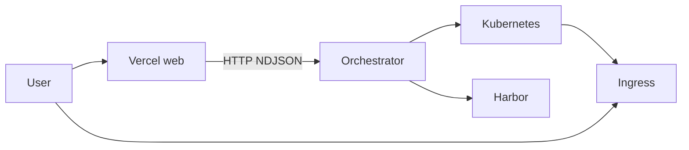

# Go-Vercel-App

A small **Vercel-style** deployment demo in Go: users sign in, submit a **public Git repository URL**, and the platform **builds a container image in Kubernetes (Kaniko)**, **pushes to Harbor**, **runs the app in the cluster**, and exposes a **public URL via Ingress**.

## Architecture

1. **Vercel** ([`vercel/`](vercel/)) — Echo web UI, sessions, GitHub OAuth and email auth. On deploy, the browser opens a WebSocket; the server calls the orchestrator over **HTTP** (no RabbitMQ).
2. **Orchestrator** ([`deploy/`](deploy/)) — Echo HTTP API **`POST /deploy-app`** (alias `POST /build-deploy`). Uses **client-go** to create a **Kaniko Job**, wait for success, then apply **Deployment**, **Service**, and **Ingress** or **HTTPRoute**. The build uses a **Dockerfile** from the Git repo (default path) **or** raw **`dockerfileContent`** mounted into the Kaniko pod. Harbor credentials are stored as a **dockerconfigjson** Secret in the workload namespace.
3. **Traffic** — End users hit `{projectID}.{INGRESS_BASE_DOMAIN}` through your ingress controller, not a separate static-file service.

## POST /deploy-app (JSON)

| Field | Required | Description |
|-------|----------|-------------|
| `githubRepoEndpoint` | yes | Public `https://github.com/org/repo` (`.git` optional) |
| `projectID` | yes | Stable id for this deployment (used in resource names / hostname) |
| `gitRef` | no | Git ref for Kaniko context; default `DEFAULT_GIT_REF` on the orchestrator |
| `dockerfile` | no | Path to Dockerfile **relative to repo root**; default `KANIKO_DOCKERFILE` env or `Dockerfile`. **Do not** set together with `dockerfileContent`. |
| `dockerfileContent` | no | Raw Dockerfile text. Mounted at build time; Git context is unchanged. **Mutually exclusive** with `dockerfile`. Max size: `MAX_DOCKERFILE_CONTENT_BYTES` (default 524288). |
| `containerPort` | no | Port the **container process** listens on; default `APP_CONTAINER_PORT` |
| `servicePort` | no | Kubernetes **Service** port (Ingress/HTTPRoute backend); default `K8S_SERVICE_PORT` |

Clients can omit optional fields and tune defaults via orchestrator environment variables.

## Repository contract (v1)

Either provide a **Dockerfile** in the repo (at the path you send, or at the default) **or** send **`dockerfileContent`** in the API. The image must expose an HTTP server on the **`containerPort`** you configure (default from **`APP_CONTAINER_PORT`**, often **8080** or **3000** for Node). See [`deploy/k8s/Dockerfile.sample`](deploy/k8s/Dockerfile.sample) and [`deploy/samples/user-static-frontend/`](deploy/samples/user-static-frontend/).

## Environment variables

Templates you can copy: [`deploy/vars.env.example`](deploy/vars.env.example) and [`vercel/vars.env.example`](vercel/vars.env.example) → `vars.env` in each directory (real `vars.env` is gitignored).

### Vercel (`vercel/vars.env`)

| Variable | Purpose |
|----------|---------|
| `ADDR` | Listen address (e.g. `:8080`) |
| `SECRET` | Session encryption key |
| `DBADDRESS` | PostgreSQL DSN for GORM |
| `CLIENT_ID` / `CLIENT_SECRET` / `GITHUB_OAUTH_CALLBACK_PATH` | GitHub OAuth |
| `APP_EMAIL` / `APP_PASSWORD` / `SMTP_HOST` / `SMTP_PORT` | Email verification |
| **`ORCHESTRATOR_ADDR`** | Base URL of orchestrator (e.g. `http://localhost:8081`) |
| **`ORCHESTRATOR_DEPLOY_PATH`** | Optional path (default **`/deploy-app`**; legacy **`/build-deploy`**) |
| **`ORCHESTRATOR_SHARED_SECRET`** | Optional; must match orchestrator if set |
| **`ORCHESTRATOR_DEFAULT_GIT_REF`** | Optional git ref (default on orchestrator side: `refs/heads/main`) |
| **`ORCHESTRATOR_HTTP_TIMEOUT_MINUTES`** | Optional HTTP client timeout (default 45) |

### Orchestrator (`deploy/vars.env`)

| Variable | Purpose |
|----------|---------|
| `ADDR` | Listen address (e.g. `:8081`) — serves **`POST /deploy-app`** (and **`POST /build-deploy`**) |
| **`K8S_NAMESPACE`** | Namespace for Jobs and workloads (must exist; apply [`deploy/k8s/namespace.yaml`](deploy/k8s/namespace.yaml)) |
| **`HARBOR_REGISTRY`** | Registry host (no scheme), e.g. `harbor.example.com` |
| **`HARBOR_PROJECT`** | Harbor project name (default `go-vercel-apps`) |
| **`HARBOR_USERNAME`** / **`HARBOR_PASSWORD`** | Push/pull registry auth |
| **`INGRESS_BASE_DOMAIN`** | e.g. `apps.example.com` → host `{projectID}.apps.example.com` |
| `INGRESS_CLASS_NAME` | Ingress class (e.g. `nginx`) |
| `INGRESS_TLS_SECRET_NAME` | Optional TLS secret in the same namespace as Ingress |
| `KUBECONFIG` | Optional; if unset, uses in-cluster config then `~/.kube/config` |
| `ORCHESTRATOR_SHARED_SECRET` | Optional shared header `X-Orchestrator-Secret` |
| `KANIKO_IMAGE` | Executor image (default `gcr.io/kaniko-project/executor:v1.23.2`) |
| `KANIKO_DOCKERFILE` | Default Dockerfile path in repo when the client omits `dockerfile` (default `Dockerfile`) |
| `MAX_DOCKERFILE_CONTENT_BYTES` | Max size for `dockerfileContent` in JSON (default `524288`; max allowed `1048576`) |
| `APP_CONTAINER_PORT` | Default container port when the client omits `containerPort` (default `8080`) |
| `K8S_SERVICE_PORT` | Default Service/Ingress/HTTPRoute port when the client omits `servicePort` (default `80`) |
| `BUILD_JOB_TIMEOUT_SEC` | Kaniko job wait timeout (default `1800`) |
| `ORCHESTRATOR_SKIP_HARBOR_TLS_VERIFY` | Set `true` for self-signed Harbor (Kaniko `--skip-tls-verify`) |
| `DEFAULT_GIT_REF` | Git ref for Kaniko context (default `refs/heads/main`) |

## Kubernetes

See [`deploy/k8s/README.md`](deploy/k8s/README.md) for namespace, RBAC, and a manual Kaniko example. End-to-end checks: [`deploy/k8s/VERIFY.md`](deploy/k8s/VERIFY.md).

## Legacy services (not used by the new flow)

The **[`upload/`](upload/)** (MinIO + RabbitMQ) and **[`request-handler/`](request-handler/)** (static files from MinIO) trees are **legacy** from the previous architecture. The active path is **Vercel → orchestrator → K8s/Harbor**.

## Tools

- Go, PostgreSQL, Kubernetes, Harbor, Ingress controller, Kaniko (pulled as Job image)
